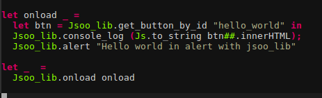

# jsoo_lib



Additional function to js_of_ocaml bindings to Javascript standard library.

## How to install?

You need to pin the repository:
```
opam pin add jsoo_lib https://github.com/dannywillems/jsoo-lib.git
```
